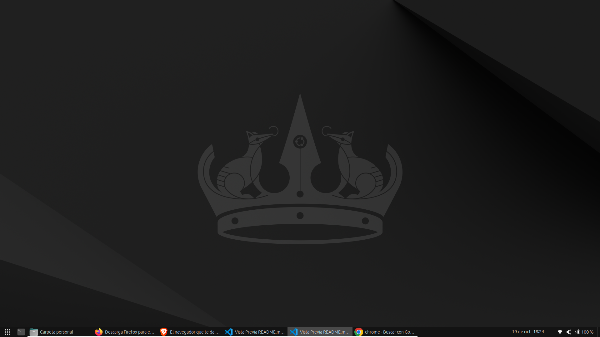
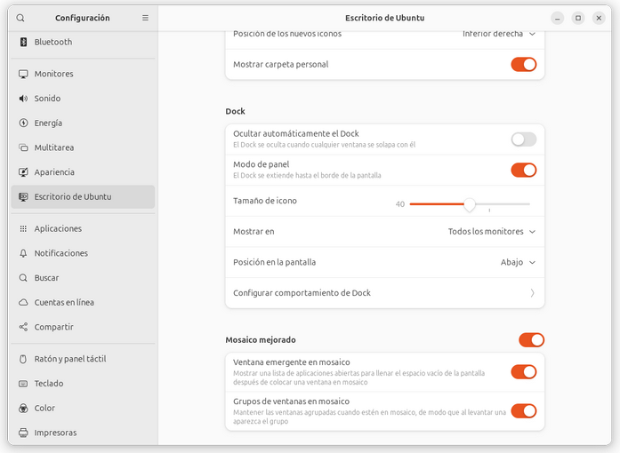
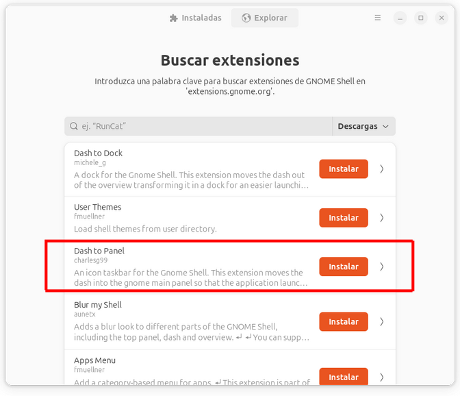
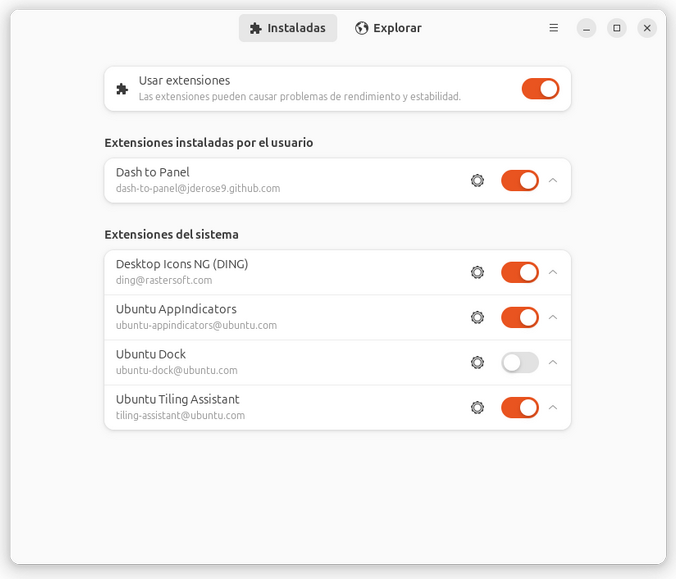
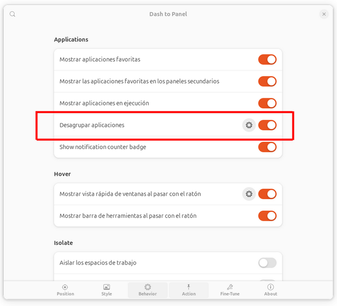
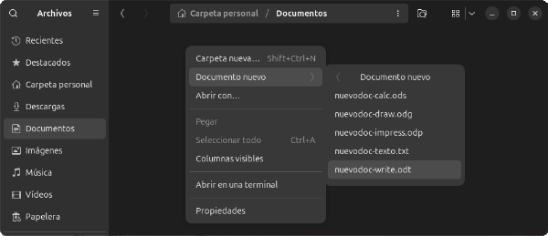
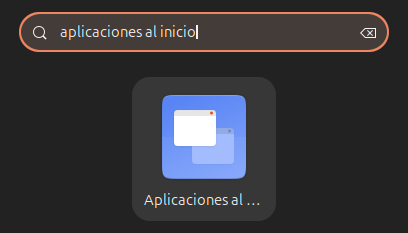
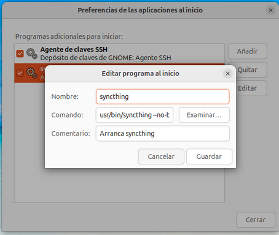

# Ubuntu 24.04

Esta es mi experiencia instalando y usando ubuntu, lo uso de manera múy básica, si tienes alguna sugerencia o aplicación que consideras que este documento debería tener no dudes en [contactarme](ec4lab@gmail.com)

Si quieres profundizar un poco más te recomiendo este [blog](https://www.freecodecamp.org/news/learn-linux-for-beginners-book-basic-to-advanced/).

# Instalación

Si vienes de windows, mi recomendación es que no lo reemplaces, puedes realizar una instalación junto a windows.

## Descarga la imagen
Descargar la imagen ISO de la web de [Ubuntu](https://ubuntu.com/download/desktop), yo prefiero 0.4LTS, tienen más soporte,pero si quieres puedes probar otras.  
También existen diferentes [Flavors](https://ubuntu.com/desktop/flavors), que sobre la misma base de ubuntu tienen herramientas adicionales o diferentes entornos de escritorio según necesites.
Si es la primera vez, te recomiendo iniciar con el ubuntu clásico y luego, si quieres, vas experimentando las demás.

## Crear un disco de arranque:
Existes varias herramientas, lo mejor actualmente es ventoy, ya que permite tener un usb con varias imágenes ISO y aún poder utilizarlo para información.
### Instalar ventoy en un usb
Descargar [ventoy](https://sourceforge.net/projects/ventoy/files/v1.1.07/)  
Crear un [usb ventoy](https://www.ventoy.net/en/doc_start.html)  
Copia la imagen descargada dentro del USB ventoy


## Instalar Ubuntu
Con la imagen dentro del usb ventoy, reinicia la pc y asegúrate que bootee desde el usb, esto cambia para cada máquina deberás googlear para la tuya en particular, en algunas es presionando `F8` o `F10` o ingresando directamente al menú de la bios con `supr` o `F2` y cambiando el orden de prioridades del booteo.

## Durante la instalación
Sigue las pantallas y coloca tus preferencias, como usuario, nombre del equipo y contraseña, uso horario, idioma de la instalación y teclado.  

En un momento te va a consultar si quieres borrar todo el disco o instalarlo junto a windows, yo uso esa opción, ahi puedes decidir que espacio dejas a windows y a ubuntu.  

Hay opciones avanzadas con la posibilidad de modificar y crear nuevas particiones, si no sabes lo que estás haciendo te recomiendo no jugar con esa sección.  

Por último para no tener problemas de compatibilidad te aconsejo:
* Instalar version completa.
* Con software y driver de terceros.

## Cambiar el tamaño de particiones.

Si te equivocaste en los tamaños o quieres modificarlos, reinicia la pc y bootea nuevamente desde el usb, pero en lugar de seleccionar <kbd>install ubuntu</kbd> selecciona <kbd>Try Ubuntu</kbd>, ya en el escritorio, abre la aplicación `Gparted`y allí puedes modificar los tamaños o incluso eliminar las particiones **MUCHO CUIDADO** esto borra todo archivo y SO que esté en esas particiones

# Personalizar Ubuntu
Si sos como yo que vengo de windows es posible que te resulte más cómodo tener el dock en la posición inferior en lugar de a la izquierda, además prefiero ver las aplicaciones desagrupadas.



## Dock Abajo
Configuración -> Escritorio de Ubuntu -> Dock  
Opción: Posición en la pantalla -> Abajo  



## Bajar la barra superior con dash to panel
Fuente: https://cambiatealinux.com/convertir-el-dock-y-la-barra-superior-de-ubuntu-en-un-panel-inferior

Primero debemos tener instalado `gnome shell-extension-manager`

En el terminal:
```bash	
sudo apt-get install chrome-gnome-shell
sudo apt-get update
sudo apt install gnome-shell-extension-manager
```
Luego Instalar y configurar Dash to panel
* Abrir la app `extension manager`.
* Buscar `Dash to panel` y Ordenar por: “Descargas”



* Instalar y activar  



* Activar `desagrupar aplicaciones` en `behavior`  



## Aplicaciones en el menú `crear nuevo`
Fuente: https://itsfoss-com.translate.goog/add-new-document-option/?_x_tr_sl=en&_x_tr_tl=es&_x_tr_hl=es&_x_tr_pto=tc  

Es posible que extrañes navegar hasta una carpeta, hacer click derecho y crear allí mismo un documento, una imagen u hoja de cálculo, lo podemos solucionar.



Para cada archivo que desees que aparezca en el menú `Documento nuevo`primero hay que crear las plantillas, por ejemplo un nuevo documento en `writer`, luego lo guardas en  
`carpeta personal/plantillas`  
Puedes crear cualquier tipo de archivo `.txt`, `.odt`, `.ods`, etc,.


# Instalar aplicaciones
Existen muchas maneras de instalar aplicaciones en ubuntu, la mayoría las puedes descargar del `centro de aplicaciones`, otras las podrás descargar como `archivos.deb` e instalarlos o ejecutar directamente `archivos.appimage`

## Instalar Anydesk en Ubuntu
Descargar [instalador.deb](https://anydesk.com/es/downloads/thank-you?dv=deb_64)

Luego abre un terminal: `ctrl`+`alt`+`t` y navega hasta el directorio donde descargaste el instalador

```bash
cd Descargas
```
 o desde el explorador vas a carpeta `Descargas`, das click derecho -> abrir en un terminal.  
en el terminal ejecutas
```bash
sudo dpkg -i anydesk_x.x.x-x_amd64.deb
#Cambiar el nombre según la versión que descargues
```
**💡 TIP**: Para no errarle con el nombre del archivo y evitar copiarlo entero, escribe `sudo dpkg -i any` y luego presiona `tab`, esto completará automáticamente el nombre del archivo, en caso de existir varios que empiecen con `any` mostrará todas las alternativas que existan, basta escribir 2 o 3 letras más y volver a presionar `tab` para que autocomplete.

## Instalar Brave en Ubuntu
Simplemente instalar desde el centro de aplicaciones de Ubuntu

## Instalar Calibre en Ubuntu
Calibre cuenta con una instalación binaria que incluye versiones privadas y todas sus dependencias.  
Para instalar o actualizar, abrir un terminal `ctrl`+`alt`+`t` :
```bash
sudo -v && wget -nv -O- https://download.calibre-ebook.com/linux-installer.sh | sudo sh /dev/stdin
```
Se puede cambiar la carpeta donde se instala calibre (la predeterminada es /opt):
```bash 
sudo -v && wget -nv -O- https://download.calibre-ebook.com/linux-installer.sh | sudo sh /dev/stdin install_dir=/AppImage
#Cambie /AppImage a la carpeta donde quiera que se instale calibre automáticamente. 
```
### Troubleshooting

#### You are missing the system library libxcb-cursor.so.0. Try installing packages such as libxcb-cursor0 or xcb-cursor
instalar librería faltante:
```bash
sudo apt install libxcb-cursor0
```

## Instalar Chrome en Ubuntu
Descargar el [Instalador.Deb](https://www.google.com/intl/es-419/chrome/dr/download/?brand=FKPE&ds_kid=43700081396058055&gad_source=1&gclid=Cj0KCQiA_NC9BhCkARIsABSnSTZEbVLX87bNF4q2sMf9cHQ_FGu-kCSta00VghCxGE0sMR7gRZfr0XsaAgE4EALw_wcB&gclsrc=aw.ds)

Luego abre un terminal: `ctrl`+`alt`+`t` y navega hasta el directorio donde descargaste el instalador

```bash
cd Descargas
```
 o desde el explorador vas a carpeta `Descargas`, das click derecho -> abrir en un terminal.  
en el terminal ejecutas
```bash
sudo dpkg -i google-chrome-stable_current_amd64.deb 
#Cambiar el nombre según la versión que descargues
```
**💡 TIP**: Para no errarle con el nombre del archivo y evitar copiarlo entero, escribe `sudo dpkg -i goog` y luego presiona `tab`, esto completará automáticamente el nombre del archivo, en caso de existir varios que empiecen con `goog` mostrará todas las alternativas que existan, basta escribir 2 o 3 letras más y volver a presionar `tab` para que autocomplete.


## Instalar Dropbox en Ubuntu.
Descargar el [Instalador.Deb](https://www.dropbox.com/install)

Luego abre un terminal: `ctrl`+`alt`+`t` y navega hasta el directorio donde descargaste el instalador

```bash
cd Descargas
```
 o desde el explorador vas a carpeta `Descargas`, das click derecho -> abrir en un terminal.  
en el terminal ejecutas
```bash
sudo dpkg -i Dropbox.deb
#Cambiar el nombre según la versión que descargues
```
**💡 TIP**: Para no errarle con el nombre del archivo y evitar copiarlo entero, escribe `sudo dpkg -i Drop` y luego presiona `tab`, esto completará automáticamente el nombre del archivo, en caso de existir varios que empiecen con `Drop` mostrará todas las alternativas que existan, basta escribir 2 o 3 letras más y volver a presionar `tab` para que autocomplete.

## Instalar FFmpeg en Ubuntu

En un terminal:
```bash
sudo apt update
sudo apt install Ffmpeg
```
### Convertir video a gif, redimensionando el archivo de salida
```bash
#convierte la medida más larga a 600 y la otra proporcional
ffmpeg -i input_video.mp4 -vf "scale='if(gte(iw,ih),600,-1)':'if(gte(iw,ih),-1,600)'" output.gif
```
### Cambiar de velocidad del gif:
```bash
# Aumentar la velocidad (steps=menor que 1)
# Disminuir la velocidad (steps=mayor que 1

# Aumentar la velocidad de un gif al doble
ffmpeg -i input.gif -filter_complex "[0]steps=0.5*PTS" output_fast.gif

#Disminuir la velocidad de un gif a la mitad
ffmpeg -i input.gif -filter_complex "[0]steps=2*PTS" output_slow.gif
```
### Cambiar tamaño del gif
```Bash
# Reducir la resolución del GIF a 400
ffmpeg -i input_video.mp4 -vf "scale='if(gte(iw,ih),400,-1)':'if(gte(iw,ih),-1,400)'" output.gif
#Este comando ajusta la resolución a 400px en la dimensión más larga.

# Reducir la cantidad de fotogramas
ffmpeg -i input_video.mp4 -vf "fps=10,scale='if(gte(iw,ih),600,-1)':'if(gte(iw,ih),-1,600)'" output.gif
# Ajusta el valor de FPS a 10

# Filtro de reducción de colores (2 pasos)
Genera la paleta de colores:
ffmpeg -i input_video.mp4 -vf "fps=10,scale='if(gte(iw,ih),600,-1)':'if(gte(iw,ih),-1,600)',palettegen" palette.png

#Usar paleta para crear el GIF optimizado:
ffmpeg -i input_video.mp4 -i palette.png -filter_complex "fps=10,scale='if(gte(iw,ih),600,-1)':'if(gte(iw,ih),-1,600)',paletteuse" output.gif

# Comprimir el GIF
gifsicle -O3 --colors 256 input.gif -o output_compressed.gif
```

### Generar un gif de bajo peso
```bash
ffmpeg -i input_video.mp4 -vf "fps=10,scale='if(gte(iw,ih),400,-1)':'if(gte(iw,ih),-1,400)',palettegen" -y palette.png && ffmpeg -i input_video.mp4 -i palette.png -filter_complex "fps=10,scale='if(gte(iw,ih),600,-1)':'if(gte(iw,ih),-1,600)',paletteuse" output.gif
#Desglose del comando:

#-vf "fps=10,scale='if(gte(iw,ih),400,-1)':'if(gte(iw,ih),-1,400)',palettegen":
#		Reduce los fotogramas por segundo a 10.
#		Redimensiona el GIF manteniendo la relación de aspecto con la dimensión más larga ajustada a 600px.
#		Genera la paleta de colores optimizada.
#&&:    Esto asegura que el segundo comando se ejecute solo si el primero se ejecuta con 		éxito.
#fmpeg -i input_video.mp4 -i palette.png -filter_complex "fps=10,scale='if(gte(iw,ih),600,-1)':'if(gte(iw,ih),-1,600)',paletteuse":
#		Utiliza la paleta generada para optimizar los colores.
#		Aplica los ajustes de resolución y fotogramas por segundo nuevamente para asegurarse de que el GIF final cumpla con los parámetros establecidos.
```
## Instalar FreeCad en Ubuntu
Simplemente instalar desde la tienda de aplicaciones

## Instalar GIMP en Ubuntu
En un terminal:
```Bash
sudo apt-get update
sudo apt install gimp
```

## Instalar git en Ubuntu
Desde una ventana en el terminal
```bash
sudo apt update
sudo apt install git
```

## Instalar InkScape en Ubuntu
En un terminal
```bash
sudo apt-get update
sudo apt-get install inkscape
```

## Instalar Kdenlive en Ubuntu
En un terminal
```bash
sudo apt-get update
sudo apt-get install kdenlive
```

## Instalar LibreOffice en Ubuntu
Ya viene instalado con la versión completa de Ubuntu

### Actualizar LibreOffice
En un terminal
```bash
sudo add-apt-repository ppa:libreoffice/ppa
sudo update
sudo upgrade
```
### Instalar codecs de video adicionales para LibreOffice
```bash
sudo apt-get install libreoffice-avmedia-backend-gstreamer
```
Fuente: https://itsfoss.com/install-media-codecs-ubuntu/
```bash
sudo add-apt-repository multiverse
sudo apt update
sudo apt install ubuntu-restricted-extras
```
### Agregar Fuentes
En un terminal crear una carpeta para guardar las fuentes:
```bash
mkdir ~/.fonts
```
Descargar fuentes (‘.ttf‘ o ‘.otf‘.)y guardarlas en esa carpeta.  
Algunas fuentes gratuitas [aquí](https://www.1001freefonts.com/es/)

## Instalar OBS Studio en ubuntu
Primero instalar ffmpeg  
En un terminal
```bash
sudo apt-get update
sudo apt-get install ffmpeg
```

Instalar OBS Studio:
```Bash
sudo add-apt-repository ppa:obsproject/obs-studio
sudo apt update
sudo apt-get update && sudo apt-get install obs-studio
```
### Configurar OBS Studio
+ Salida –> Ver Carpeta.
+ Generar siempre en mkv (por si se corta),Luego convertir a .mov
+ Salida 1920x1080 es una buena calidad y a un peso razonable

### Primer uso
+ Optimizar para grabaciones.
+ Ver que la salida coincida con el lienzo, sino sale cualquier cosa.
+ Ajustes → Salida → Ver que los videos salgan en “home/{USER}/Videos”

### Plugin Input Overlay (Teclado en pantalla)
Aún no lo probé [Repositorio](https://github.com/univrsal/input-overlay)

## Instalar PiImager en Ubuntu
Descargar el [Instalador.Deb](https://www.raspberrypi.com/software/)  
Luego abre un terminal: `ctrl`+`alt`+`t` y navega hasta el directorio donde descargaste el instalador

```bash
cd Descargas
```
 o desde el explorador vas a carpeta `Descargas`, das click derecho -> abrir en un terminal.  
en el terminal ejecutas
```bash
sudo dpkg -i rpi-imager_x.x.x_ubuntu.deb
#Cambiar el nombre según la versión que descargues
```
**💡 TIP**: Para no errarle con el nombre del archivo y evitar copiarlo entero, escribe `sudo dpkg -i rpi` y luego presiona `tab`, esto completará automáticamente el nombre del archivo, en caso de existir varios que empiecen con `rpi` mostrará todas las alternativas que existan, basta escribir 2 o 3 letras más y volver a presionar `tab` para que autocomplete.

## Instalar Pinta en Ubuntu
Instalar desde el centro de aplicaciones

## Instalar Python en Ubuntu

Normalmente Ubuntu ya trae instalado python, puedes verificar la versión con
```bash
python3 --version
```
Si quieres instalar la versión más reciente desde los repositorios oficiales primero se debe actualizar la lista de paquetes
```bash
sudo apt update
```
y luego instalar python3
```bash
sudo apt install python3
```
Si deseas instalar una versión diferente de Python, o bien tener varias, simplemente debemos instalarlas
```bash
sudo apt install python3.10
sudo apt install python3.9
sudo apt install python3.8
sudo apt install python3.7
sudo apt install python3.6
```
También se puede instalar el gestor de paquetes pip
```bash
sudo apt install python3-pip. 
```

## Instalar scrcpy en Ubuntu
App para ver el celular en la pantalla de la PC.

En el Celular Activar depuración por USB
+ Ir a Acerca del teléfono
+ Version del S.O. -> click 7 veces para activar modo desarrollador.
+ En sistema -> avanzado -> Depuración por usb -> Activar
+ Algunos móviles requieren también Instalar vía USB y Depuración USB (ajustes de seguridad)
+ Te recomiendo desactivarlo cuando termines


En un terminal
```bash
sudo apt update
sudo apt install scrcpy   
```
### para ejecutar
En un terminal
```bash
scrcpy
```
### Sistemas Android modernos
Es posible que de errores si el S.O. del teléfono es demasiado nuevo, se puede ejecutar la última versión directamente desde la fuente:

https://github.com/Genymobile/scrcpy/releases/

Ahí copias el link de la última versión `linux-x86_64-vx.x.x.tar.gz`

al momento de este post es:  
https://github.com/Genymobile/scrcpy/releases/download/v3.3.3/scrcpy-linux-x86_64-v3.3.3.tar.gz

Luego ejecutar en un terminal

```bash
# Descargar librerías y gestor de archivos comprimidos .tar
sudo apt install ffmpeg libsdl2-2.0-0 adb wget tar -y
```
```bash
# Descargar el archivo
wget https://github.com/Genymobile/scrcpy/releases/download/v3.3.3/scrcpy-linux-x86_64-v3.3.3.tar.gz
```
```bash
# Descomprimir
tar -xzf scrcpy-linux-x86_64-v3.3.3.tar.gz
```
```bash
# Entrar a la carpeta
cd scrcpy-linux-x86_64-v3.3.3
# y ejecutar
./scrcpy #tal vez te pida sudo
```
Puedes ejecutar directamente desde la carpeta personal
```bash
scrcpy-linux-x86_64-v3.3.3/./scrcpy #tal vez te pida sudo.
```
### troubleshooting
#### Could not open audio device
No logré recibir audio, como lo lo necesito ejecuto directamente:
```bash
scrcpy-linux-x86_64-v3.3.3/./scrcpy --no.audio #tal vez te pida sudo.
```

## Instalar Syncthing en Ubuntu
Fuente: https://apt.syncthing.net/
En un terminal

```bash
sudo apt-get update
sudo apt-get install syncthing
```
### Hacer que syncthing arranque en el inicio (si no lo hace ya)
Abrir aplicaciones al inicio



Añadir
**Nombre:** Synchting  
**Comando:**
```bash
usr/bin/syncthing --no-browser-home="/home/{USER}/.config/syncthing"
# Cambia {USER} por tu usuario
```


Para confirmar la ubicación de syncthing ( usr/bin/syncthing) ejecutar:
```bash
sudo which syncthing
```
### Troubleshooting

#### Falta el marcador en la carpeta
Simplemente generar una carpeta `.stfolder` dentro de la carpeta antes de comenzar a sincronizar.

#### Sincronización detenida, pero  sigue sincronizando
Resetear la base de datos en syncthing
```bash
syncthing –reset-database
```

## Instalar Tailscale en Ubuntu
Tailscale es una VPN muy fácil de configurar.

### Instalar
```bash
sudo curl -fsSL https://tailscale.com/install.sh | sh
```

### Iniciar y activar Tailscale:
```bash
sudo tailscale up
```
### Exponer redes
fuente: https://tailscale.com/kb/1019/subnets?tab=linux

```bash
echo 'net.ipv4.ip_forward = 1' | sudo tee -a /etc/sysctl.d/99-tailscale.conf
echo 'net.ipv6.conf.all.forwarding = 1' | sudo tee -a /etc/sysctl.d/99-tailscale.conf
sudo sysctl -p /etc/sysctl.d/99-tailscale.conf
```
### Exponer IP’s de nuestra red local en tailscale:
```bash
sudo tailscale up --advertise-routes=192.168.xxx.xxx/24 
# Cambiar xxx.xxx de acuerdo a tu red
```
### Nodo de salida
Es posible configurar nuestro servidor como un nodo de salida  
Fuente: https://tailscale.com/kb/1103/exit-nodes?tab=linux
```bash
sudo tailscale up --advertise-exit-node
# Puede que exija explicitar la red, solo copiar el comando que nos muestra, ejecutar con sudo.
```
### Actualizar tailscale de manera automática
```bash
sudo tailscale set –auto-update
```
### Actualizar tailscale de manera manual
```bash
sudo tailscale update
```
### Desinstalar cualquier instalación anterior de Tailscale:
```bash
sudo apt remove tailscale
sudo apt purge tailscale
```
### Limpiar archivos de configuración
Esto eliminará cualquier archivo residual de configuraciones previas
```bash
sudo rm -rf /var/lib/tailscale /etc/tailscale
```
## Es recomendable actualizar el sistema para evitar problemas de dependencias:
```bash
sudo apt update
sudo apt upgrade
```

## Instalar UltimakerCura en Ubuntu

Descargar el [appimage](https://ultimaker.com/es/software/ultimaker-cura/#downloads)

Mover el archivo a la carpeta donde quieras ejecutarlo

Hacer ejecutable:  
En la carpeta del appimage, abrir en el terminal y:
```bash
# Dar permisos de ejecución a UltimakerCura:
chmod +x UltiMaker-Cura-x.xx.x-linux-X64.AppImage
# Ajustar nombre de archivo según versión
```
Puedes Ejecutar Ultimakercura con doble click sobre el `.appimage`o desde el terminal:
```bash
./Cura.AppImage
```
### troubleshooting
#### Problemas de libfuse.
```bash
#Instalar libfuse2
sudo apt install libfuse2
```
#### Problemas de canberra-gtk-module:
```bash
#Instalar libcanberra-gtk-module
sudo apt install libcanberra-gtk-module libcanberra-gtk3-module
```

## Instalar Virtual box en Ubuntu.

Descargar el [instalador.deb](https://www.virtualbox.org/wiki/Linux_Downloads)
Luego abre un terminal: `ctrl`+`alt`+`t` y navega hasta el directorio donde descargaste el instalador

```bash
cd Descargas
```
 o desde el explorador vas a carpeta `Descargas`, das click derecho -> abrir en un terminal.  
en el terminal ejecutas
```bash
sudo dpkg -i virtualbox-x.x_x.x.xx-xxxxxx~Ubuntu~jammy_amd64.deb
#Cambiar el nombre según la versión que descargues
```
**💡 TIP**: Para no errarle con el nombre del archivo y evitar copiarlo entero, escribe `sudo dpkg -i virt` y luego presiona `tab`, esto completará automáticamente el nombre del archivo, en caso de existir varios que empiecen con `virt` mostrará todas las alternativas que existan, basta escribir 2 o 3 letras más y volver a presionar `tab` para que autocomplete.

### troubleshooting
#### Solucionar problemas de instancias de virtualbox
```bash
sudo apt-get install -f
```
Y volver a instalar el `.deb`

#### Virtualbox ubuntu kernel driver not installed (rc=-1908)
Ver: https://ubuntinux.blogspot.com/2020/04/solucion-error-de-virtualbox-kernel.html  
En el terminal
```Bash
sudo apt install --reinstall virtualbox-dkms && sudo apt install libelf-dev
```


## Instalar VLC media Player en Ubuntu
En un terminal
```bash
sudo apt-get update
sudo snap install vlc
```

## Instalar VSCode en Ubuntu
Puedes instalarla desde la tienda, pero no suele ser la versión más reciente, para esto necesitarás descargar el `instalador.deb` del [sitio oficial](https://code.visualstudio.com/)

Luego abre un terminal: `ctrl`+`alt`+`t` y navega hasta el directorio donde descargaste el instalador

```bash
cd Descargas
```
 o desde el explorador vas a carpeta `Descargas`, das click derecho -> abrir en un terminal.  
en el terminal ejecutas
```bash
sudo dpkg -i code_1.xxx.x-xxxxxxxxxx_amd64.deb
#Cambiar el nombre según la versión que descargues
```
**💡 TIP**: Para no errarle con el nombre del archivo y evitar copiarlo entero, escribe `sudo dpkg -i code` y luego presiona `tab`, esto completará automáticamente el nombre del archivo, en caso de existir varios que empiecen con `code`mostrará todas las alternativas que existan, basta escribir 2 o 3 letras más y volver a presionar `tab` para que autocomplete.

### ☝️ Algunas recomendaciones
Sincroniza con tu cuenta de `github`, asi cada vez que instales tus preferencias y extensiones te acompañaran.

### Extensiones útiles:
+ Python  
+ Pylance  
+ ESPhome  
+ ESPHome Snippets
+ Code Spell Checker
+ Spanish - Code Spell Checker

### Personalizar `settings.json`
presionar `ctrl`+`shift`+`p`  
escribir `settings`
y click en `Open User Settings (JSON)`  
puedes agregar las opciones que deses, mucho ojo con las comas


## Instalar Wiresshark en Ubuntu
En un terminal
```bash
sudo apt-get update
sudo apt-get install wireshark
```

# Comandos comunes en Ubuntu

Fuente: https://www.linuxcommand.org

Listado de algunos comandos útiles, para ejecutarlos necesitas abrir un terminal, puedes hacerlo desde el acceso directo en las aplicaciones o con `ctrl`+`alt`+`t`.

Si quieres evitar arrancar desde el directorio personal `/home/usuario/` y tener que navegar con comandos hasta la carpeta donde desees ejecutar el comando o trabajar con algún archivo, puedes navegar desde el explorador `archivos` o `nemo`, luego click derecho -> Abrir en un terminal

Recuerda que puedes utilizar auto completar escribiendo las primeras letras de un comando o nombre de un archivo y presionar `tab`

Para ejecutar comandos que realizaste hace poco puedes recorrerlos con la flecha hacia arriba.

Para ver todos los comandos que algunas vez ejecutaste
```bash
history
```
Ver version de ubuntu instalada
```bash
lsb_release -a
```
Saber donde estás:
```bash
pwd
```
Ver los archivos y carpetas que hay en el directorio donde estás
```bash
ls # Veras diferentes colores para carpetas o archivos
ls -a # Muestra también los archivos y carpetas ocultos
ls -a -n # Los muestra como una tabla, y los permisos de escritura y lectura
ls -R # Archivos y carpetas, recursivo a subdirectorios
```
Navegar entre carpetas
```bash
cd Descargas/ # ingresa a la carpeta descargas
cd .. #vuelve a la carpeta superior
cd / # va a la raíz
```
Crear una carpeta
```bash
mkdir CARPETA_NUEVA
```
Borrar un archivo
```bash
rm ARCHIVO.txt
```
Borrar una carpeta y todo su contenido
```bash
rm -R CARPETA_A_BORRAR
```
Mover o Renombrar un archivo o carpeta
```bash
# mueve ARCHIVO.tx a la carpeta Documentos.
mv ARCHIVO.txt Documentos/ARCHIVO.txt
# Renombra ARCHIVO.txt como LISTADO.txt
mv ARCHIVO.txt LISTADO.txt
# mueve ARCHIVO.tx a la carpeta Documentos y lo renombra a LISTADO.txt
mv ARCHIVO.txt Documentos/LISTADO.txt
```
Limpiar la pantalla
```Bash
clear
```
Actualizar repositorios y dependencias
```bash
sudo apt-get update
sudo apt-get -s upgrade
```
Instalar un paquete.deb
```bash
sudo dpkg -i PAQUETE.deb
```
Editar un archivo de texto con nano
```bash
nano ARCHIVO.txt
```
Mostrar el contenido de un fichero:
```bash
cat archivo.txt
```
Cambiar la propiedad de un archivo o carpeta:
```bash
sudo chown USUARIO:GRUPO Documentos/ARCHIVO.txt # un solo archivo
sudo chown USUARIO:GRUPO -R Documentos/ # recursivo a todo lo que haya dentro de Documentos
```
Permisos:
```bash
chmod -R 770 Documentos/ARCHIVO.txt
# Primer dígito: Permisos del administrador
# Segundo dígito: Permisos del usuario
# Tercer dígito: Permisos de terceros
# Niveles de permiso: se determina como la suma de
#       4 (leer)+ 2 (escribir) + 1 (ejecutar), entonces:
#       0 (0+0+0), no tiene permisos
#       1 (0+0+1), puede ejecutar
#       2 (0+2+0), puede escribir
#       3 (0+2+1), puede ejecutar y escribir
#       4 (4+0+0), puede leer
#       5 (4+0+1), puede leer y ejecutar
#       6 (4+2+0), puede leer y escribir
#       7 (4+2+1), puede leer,escribir y ejecutar
```
acceso ssh:
```bash
ssh usuario@IP_O_DOMINIO # puerto 22
ssh usuario@IP_O_DOMINIO -6254 # puerto especial
```
Reiniciar red
```bash
sudo systemctl restart NetworkManager.service
```
Ver la dirección IP de la red local
```bash
ip a
```
Unidades conectadas (discos y unidades externas)
```bash
lsblk # Datos crudos
lsblk -o NAME,SIZE,FSTYPE,MOUNTPOINT,LABEL,MODEL,FSUSED,FSAVAIL #tabla con labels

```
Fecha y hora
```bash
date
```
Detectar en que puerto esta conectado un USB o Microcontrolador
```bash
watch -n 1 ls /dev/ttyUSB* /dev/ttyACM*
#para detener ctrl+C
```